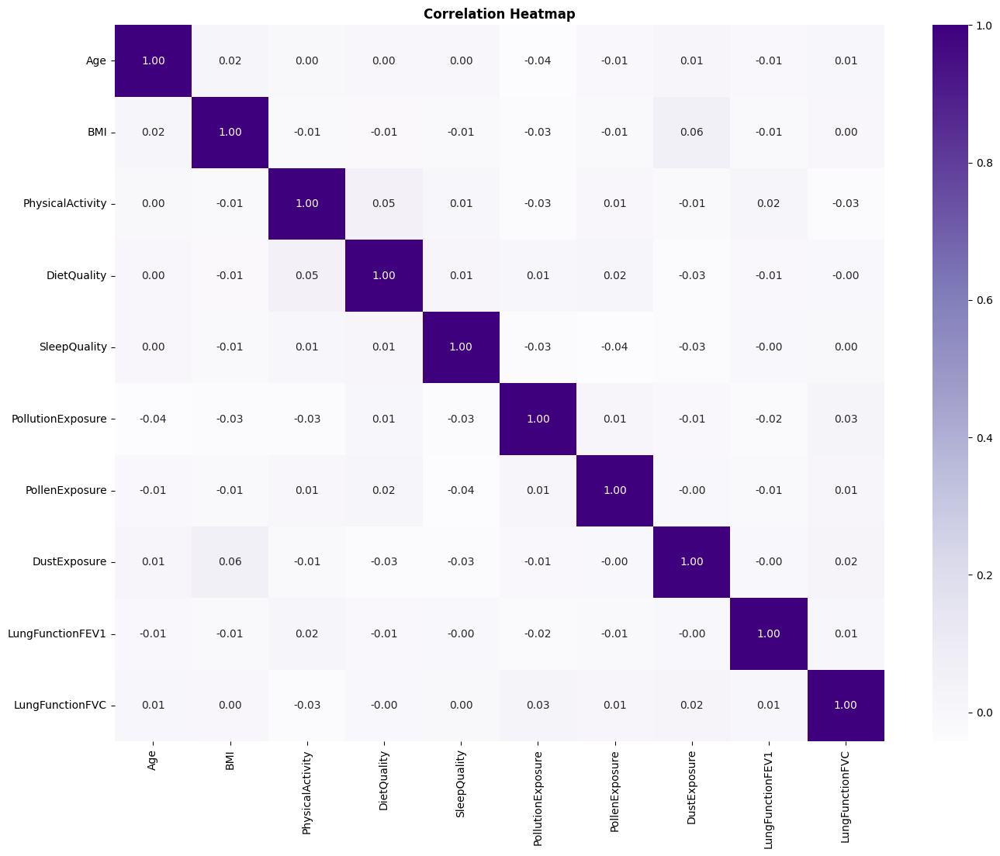

# Asthma Disease Prediction
ML models are effectively used to solve the problem of asthma disease detection with statistical data from a Kaggle dataset. The models were trained and evaluated on a variety of parameters. 
Pre-processing and ensemble techniques such as PCA and bagging were utilized to further increase the performance of the models.

This repository contains a Python script for predicting asthma disease using various machine-learning models. The script performs data preprocessing, exploratory data analysis, model training, and evaluation.

## 💾 **Dataset**
The dataset used for this project is stored in `asthma_disease_data.csv`, which includes various patient attributes such as demographics, medical history, environmental exposures, and lung function measurements.
* Asthma Disease Dataset: [https://www.kaggle.com/datasets/rabieelkharoua/asthma-disease-dataset/data](https://www.kaggle.com/datasets/rabieelkharoua/asthma-disease-dataset/data)

## :bar_chart: **Exploratory Data Analysis**

*  Includes analysis of patient demographics, medical history, and environmental exposures.
*  Visualizations using histograms, correlation heatmaps, and countplots.

This heatmap shows the correlation between different numerical features in the dataset, revealing potential relationships and multicollinearity.

## :robot: **Models**
The script explores a range of machine-learning models for asthma prediction, including:

- Logistic Regression
- Decision Tree
- Random Forest
- Gradient Boosting
- Ada Boost
- XGBoost
- Neural Network (using TensorFlow/Keras)
- Support Vector Machine (SVM)
- Multi-layer Perceptron (MLP)
- Naive Bayes
- K-Nearest Neighbors (KNN)

## :chart_with_upwards_trend: **Evaluation**
*  Evaluates model performance using accuracy, precision, recall, F1-score, and ROC AUC score.
*  Includes cross-validation and ROC curve visualizations.

## :scroll: **Usage**

1. Clone the repository: `git clone https://github.com/your-username/asthma-disease-prediction.git`
2. Install the required libraries: `pip install pandas scikit-learn matplotlib seaborn tensorflow xgboost lightgbm catboost imblearn`
3. Open the Jupyter Notebook `lr_asthma.ipynb` in your Jupyter environment.
4. Run the cells in the notebook.

## :trophy: **Results**

The table below shows the performance of various machine learning models on the asthma prediction task. The models are ranked by their F1-Score, which balances precision and recall.

| Model | Accuracy | Precision | Recall | F1-Score | Fbeta-Score (beta=0.5) | Jaccard Score | ROC AUC Score | Average Cross-Validation Score | Log Loss |
|---|---|---|---|---|---|---|---|---|---|
| Catboost | 0.96 | 0.95 | 0.97 | **0.96** | 0.95 | 0.92 | 0.96 | 0.96 | 1.43 |
| XGBoost | 0.96 | 0.94 | 0.97 | **0.96** | 0.95 | 0.92 | 0.96 | 0.95 | 1.51 |
| LGBM | 0.96 | 0.95 | 0.97 | **0.96** | 0.95 | 0.92 | 0.96 | 0.96 | 1.51 |
| Random Forest | 0.96 | 0.96 | 0.96 | **0.96** | 0.96 | 0.92 | 0.96 | 0.96 | 1.51 |
| Support Vector Classifier with PCA | 0.95 | 1.00 | 0.91 | **0.95** | 0.98 | 0.91 | 0.95 | 0.95 | 1.67 |
| Neural Network | 0.95 | 0.95 | 0.95 | **0.95** | 0.95 | 0.90 | 0.95 | 1.00 | 1.83 |
| Gradient Boosting | 0.93 | 0.92 | 0.94 | **0.93** | 0.92 | 0.87 | 0.93 | 0.92 | 2.58 | 
| Multi Layer Perceptron | 0.88 | 0.87 | 0.88 | **0.88** | 0.87 | 0.78 | 0.88 | 0.90 | 4.45 |
| Ada Boost | 0.87 | 0.84 | 0.91 | **0.88** | 0.85 | 0.78 | 0.87 | 0.85 | 4.68 |
| Decision Tree | 0.87 | 0.87 | 0.88 | **0.87** | 0.87 | 0.78 | 0.87 | 0.88 | 4.57 |
| Logistic Regression | 0.86 | 0.85 | 0.88 | **0.86** | 0.86 | 0.76 | 0.86 | 0.85 | 4.96 |
| K-Nearest Neighbors | 0.81 | 0.72 | 1.00 | **0.84** | 0.76 | 0.72 | 0.81 | 0.83 | 6.99 |
| Naive Bayes Classifer | 0.80 | 0.77 | 0.86 | **0.81** | 0.79 | 0.69 | 0.80 | 0.81 | 7.07 |
| Support Vector Classifier | 0.78 | 0.72 | 0.90 | **0.80** | 0.75 | 0.67 | 0.78 | 0.78 | 8.02 | 

As you can see, **Catboost, XGBoost, LGBM, and Random Forest** are the top-performing models for asthma prediction on this dataset, achieving high accuracy, precision, recall, and F1-scores.

## Note
The script may require adjustments depending on the specific dataset and desired analysis. The provided code serves as a starting point for asthma disease prediction and can be further customized and extended.
